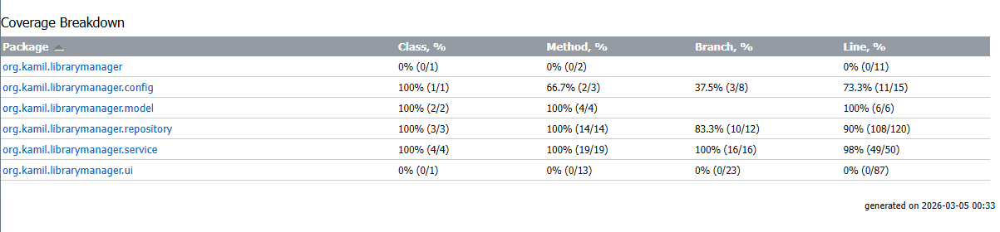
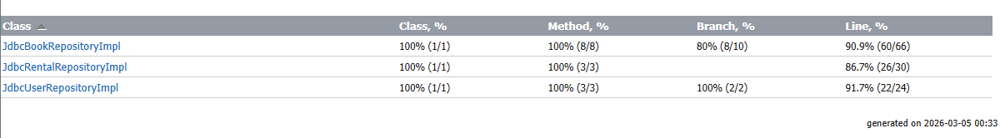

# Terminal Library Manager – Library Management System

This project is an advanced version of the Terminal Library Manager, upgraded with a **JDBC database layer**, user roles, and a rental system to fulfill the requirements of Task 3.

## Key Functionalities
The application implements the core technical requirements and three additional modules:
* **Rental System**: Users can rent and return books. The process is managed using JDBC transactions (commit/rollback) to ensure data integrity.
* **Book Categories**: Books are linked to categories (e.g., Fantasy, Sci-Fi), allowing users to filter the library collection by category name.
* **Library Statistics**: An admin-only feature that displays the total number of books, rented books, and registered users directly from the database.

## Tech Stack
* **Java 21 and Maven**: Used for project structure and dependency management.
* **JDBC (Java Database Connectivity)**: Direct implementation using `PreparedStatement`, `ResultSet`, and manual transaction management.
* **Databases**:
    * **H2 (In-Memory)**: Used for integration testing and the default application state.
    * **MySQL (Docker)**: The production-grade database running in a containerized environment.
* **Lombok**: Used for data model automation via `@Data` and `@Builder` annotations.
* **JUnit 5, Mockito, and AssertJ**: A comprehensive testing suite achieving high coverage of business logic.

## Project Architecture
The project follows a layered architecture with **Constructor-based Dependency Injection**:
* **config**: Manages database connections and schema initialization via `schema.sql`.
* **model**: Contains POJO classes such as `Book`, `User`, `Role`, and `BookStatus`.
* **repository**: Interfaces and JDBC implementations for data access (Separation of Concerns).
* **service**: Contains business logic for Authentication, Books, and Statistics.
* **ui**: The command-line interface managed by `ConsoleView`.

## Test Coverage Report
Quality assurance is a priority for this project:
* **Repository Tests**: Integration tests using the H2 database to verify SQL queries and result set mapping.
* **Service Tests**: Unit tests using Mockito to isolate business logic from database dependencies.
* **Model Tests**: Verification of Lombok-generated code, including `equals`, `hashCode`, and builders.

### Coverage Breakdown

*(Note: As seen in the attached reports, we achieved 100% method coverage for all core business logic packages.)*

### Repository Detail

*(Note: To achieve near-full coverage in the `RentalRepository`, specific tests were implemented to force `SQLExceptions`, confirming that the rollback mechanism functions correctly.)*

## Instructions for Running
### 1. Database Setup (Docker)
Start the MySQL container using the provided docker-compose file:
```bash
docker-compose up -d